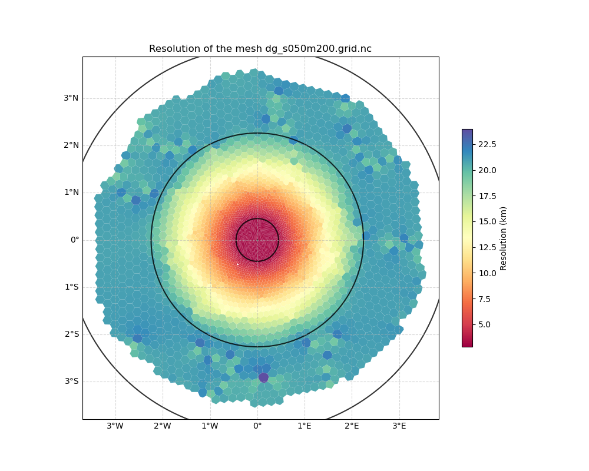
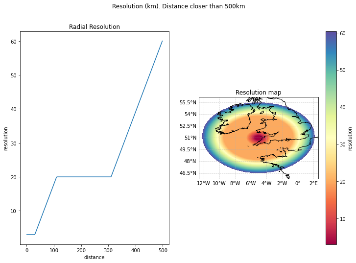

# vtx-mpas-meshes
Creation and analysis of MPAS-WRF meshes by Vortex


Work under progress.
Example of regional mesh:


Created by Marta Gil Bardají. 
Contact email: marta.gil@vortexfdc.com

## Installation Guide

To obtain a local copy of the code, clone this github repository [meshes]. Note that you need permission to do so.

    $ git clone git@github.com:marta-gil/vtx-mpas-meshes.git

The necessary conda environment can be created using the ``environment.yml`` file present in the **vtx-mpas-meshes** repository cloned from github:

    $ conda env create -n <envname> -f <path-to-environment.yml-file>

The conda environment contains:
* mpas-tools & jigsaw for mesh creation
* xarray, geopy, cartopy for mesh visualization
* packages for documentation
* jupyter notebook

The environment should be activated to run the scripts in this repository.

    $ conda activate <envname>

Then you can install the scripts of this repository by installing the `vtxmpasmeshes` source files using the `setup.py` file.

    (<envname>) $ pyhton setup.py install

To be able to run the Jupyter Notebooks, add the environment to ipykernel:

    (<envname>) $ python -m ipykernel install --user --name=<envname>

and a successful message similar to this should appear:

    Installed kernelspec <envname> in /home/<username>/.local/share/jupyter/kernels/<envname>

[meshes]: https://github.com/marta-gil/vtx-mpas-meshes.git

## Mesh generation

Creates global and regional MPAS meshes based on global latlon resolution maps. The focus is on symmetric resolutions that are highest at a certain area of the planet and decrease radially.



Based on https://github.com/pedrospeixoto/MPAS-PXT/blob/master/grids/utilities/jigsaw/spherical_grid.py by Pedro S. Peixoto  ppeixoto@usp.br.

It uses:
* MPAS-Tools http://mpas-dev.github.io/MPAS-Tools/stable/mesh_creation.html#spherical-meshes
* jigsaw: https://github.com/dengwirda/jigsaw-python/tree/master/tests

If regions want to be cut, you will also need the repository
* https://github.com/marta-gil/MPAS-Limited-Area.git
that expands a bit on the official MPAS-Limited-Area code.

## Test environment

A way to test your environement works (it easily will not, please contact me if you have issues at marta.gil@vortexfdc.com)

```
(vtx-mpas-tools) vtx-mpas-meshes/examples$ python generate_mesh.py -h
usage: generate_mesh.py [-h] [-f FOLDER_NAME] [-b BASE_PATH] [-g GRID_KIND] [-highr HIGHRESOLUTION] [-lowr LOWRESOLUTION] [-size SIZE]
                        [-margin MARGIN] [-lat LAT_REF] [-lon LON_REF] [-p] [-r] [-o]

optional arguments:
  -h, --help            show this help message and exit
  -f FOLDER_NAME, --folder_name FOLDER_NAME
                        output folder for mesh files.
  -b BASE_PATH, --base_path BASE_PATH
                        basepath where we want to create the folder.
  -g GRID_KIND, --grid_kind GRID_KIND
                        
                                Grid option: 
                         
                                "  doughnut": 
                                         <High resolution> area of a certain radius <size>. 
                                         Linear increase of resolution to a certain <low
                                         resolution> value after <margin>km. 
                                         Keep the constant low resolution value for a while
                                         (10*low_resolution)km and then increase it linearly
                                         again until reaching 1000km (to save space).
                                         The requested MPAS region should be circular and 
                                         have a radius of <size>+<margin>. The buffer 
                                         generated by the MPAS-Limited-Area code will then
                                         consist of a few "rings" of <lowresolution> cells.
                                         
                        
                                
  -highr HIGHRESOLUTION, --highresolution HIGHRESOLUTION
                        Highest-resolution of grid (km).
  -lowr LOWRESOLUTION, --lowresolution LOWRESOLUTION
                        Lowest-resolution of grid (km).
  -size SIZE, --size SIZE
                        Radius of the highest-resolution area of the grid (km).
  -margin MARGIN, --margin MARGIN
                        Size of the variable resolution boundary around the high resolution area (km).
  -lat LAT_REF, --lat_ref LAT_REF
                        Central latitude.
  -lon LON_REF, --lon_ref LON_REF
                        Central longitude.
  -p, --withplots       generate plots to view the mesh.
  -r, --do_region       cut the region out of the mesh.
  -o, --overwrite       overwrite existing folder.
  
```

Another important thing is to set the path to the MPAS-Limited-Area code as an environment variable.

```
$ export PATH_LIMITED_AREA=</path/to/MPAS-Limited-Area>
```

The version of the code used is a personal branch: https://github.com/marta-gil/MPAS-Limited-Area.git
where I expanded the original create_region script to be more flexible. 
Theoretically, the original code should work as well, but one you will need to manually make sure `cut_circular_region_beta` is not called (and use `cut_circular_region` instead). There are more comments about this inside the code.


## Example of mesh generation

Let's do a regional mesh that has a central region of 3km resolution and radius 30km, with a margin of 150km where the resolution increases up to 30km, centered at 41.0000, 1.0000. We will plot the resolution map and the mesh will be cut to represent the region.

The output can be seen in the `examples/zoomin_ref` folder.

The regional mesh has 1580 cells, no obtuse triangles and the full process took 63s!


```
~$ export PATH_LIMITED_AREA=</path/to/MPAS-Limited-Area>
~$ conda activate vtx-mpas-tools
~$ cd vtx-mpas-meshes/examples
(vtx-mpas-tools) ~/vtx-mpas-meshes/examples$ python generate_mesh.py -f zoomin -highr 3 -lowr 30 -size 30 -margin 150 -lat 41 -lon 1 -p -r -o
Overwriting folder ./zoomin

>> Creating a variable resolution map
	Resolution in km of lat/lon grid: 3.0
	Computing the distance to the reference point (41.00, 1.00)
	Computing resolutions using technique doughnut
 .. finished finding resolution map: 13.118s


Plotting
	 .. plotting for distances <= 500km
	 .. plotting for distances <= 480km
	 .. plotting for distances <= 180km
 .. finished doing resolution plots: 19.858s


>> Generating an MPAS mesh

	 .- Jigsaw generation
 
#------------------------------------------------------------
#
#   ,o, ,o,       /                                 
#    `   `  e88~88e  d88~\   /~~~8e Y88b    e    / 
#   888 888 88   88 C888         88b Y88b  d8b  /   
#   888 888 "8b_d8"  Y88b   e88~-888  Y888/Y88b/  
#   888 888  /        888D C88   888   Y8/  Y8/     
#   88P 888 Cb      \_88P   "8b_-888    Y    Y    
# \_8"       Y8""8D                             
#
#------------------------------------------------------------
# JIGSAW: an unstructured mesh generation library.  
#------------------------------------------------------------
 
  JIGSAW VERSION 0.9.14

  Reading CFG. file...

  CFG. data summary...

  GEOM-FILE = mesh.msh 
  MESH-FILE = mesh-MESH.msh 
  HFUN-FILE = mesh-HFUN.msh 
  INIT-FILE =  
  TRIA-FILE =  
  BNDS-FILE =  

  GEOM-SEED = 8 
  GEOM-PHI1 = 6.00e+01 
  GEOM-PHI2 = 6.00e+01 
  GEOM-ETA1 = 4.50e+01 
  GEOM-ETA2 = 4.50e+01 
  GEOM-FEAT = FALSE 

  INIT-NEAR = 1.00e-08 

  HFUN-SCAL = ABSOLUTE 
  HFUN-HMAX = inf 
  HFUN-HMIN = 0.00e+00 

  BNDS-KERN = BND-TRIA 
  MESH-KERN = DELFRONT 
  MESH-TOP1 = FALSE 
  MESH-TOP2 = FALSE 
  MESH-ITER = 500000 
  MESH-DIMS = 2 
  MESH-SIZ1 = 1.33e+00 
  MESH-SIZ2 = 1.30e+00 
  MESH-SIZ3 = 1.29e+00 
  MESH-EPS1 = 3.33e-01 
  MESH-EPS2 = 3.33e-01 
  MESH-RAD2 = 1.05e+00 
  MESH-RAD3 = 2.05e+00 
  MESH-OFF2 = 9.70e-01 
  MESH-OFF3 = 1.10e+00 
  MESH-SNK2 = 2.00e-01 
  MESH-SNK3 = 3.33e-01 
  MESH-VOL3 = 0.00e+00 

  OPTM-KERN = ODT+DQDX 
  OPTM-ITER = 5000 
  OPTM-QTOL = 1.00e-07 
  OPTM-QLIM = 9.38e-01 
  OPTM-ZIP_ = TRUE 
  OPTM-DIV_ = TRUE 
  OPTM-TRIA = TRUE 
  OPTM-DUAL = FALSE 

  Done. (3.75e-04sec)

#------------------------------------------------------------

  Reading GEOM file...

  Done. (1.50e-05sec)

#------------------------------------------------------------

  Forming GEOM data...

  GEOM data summary...

  ELLIPSOID-MESH

  |NDIMS.| = 3

  |1-RAD.| = 6.37e+03 
  |2-RAD.| = 6.37e+03 
  |3-RAD.| = 6.37e+03 

  |COORD.| = 0
  |EDGE-2| = 0

  |SEEDS.| = 0

  Done. (6.90e-05sec)

#------------------------------------------------------------

  Reading HFUN file...

  Done. (8.89e+00sec)

#------------------------------------------------------------

  Forming HFUN data...

  HFUN data summary...

  ELLIPSOID-GRID

  .MIN(H). = 3.00e+00
  .MAX(H). = 1.00e+03
  
  |XGRID.| = 13201
  |YGRID.| = 6601
  
  PERIODIC = TRUE

  Done. (4.58e-01sec)

#------------------------------------------------------------

  Generate rDT MESH...

#------------------------------------------------------------
#    |ITER.|      |DEL-1|      |DEL-2|      |DEL-3| 
#------------------------------------------------------------
       3592            0         7196            0

  Done. (7.25e-02sec)

#------------------------------------------------------------

  Forming MESH data...

  Done. (3.33e-03sec)

#------------------------------------------------------------

  MESH optimisation...

#------------------------------------------------------------
#    |MOVE.|      |FLIP.|      |MERGE|      |SPLIT| 
#------------------------------------------------------------
       3598            0           18            0
       3576            0            1            0
       3460            0            0            0
       3334            0            0            0
       3225            0            0            0
       3178            0            0            0
       3154            0            0            0
       3123            0            0            0
       3094            0            0            0
       3068            0            0            0
       3067            0            0            0
       3061            0            0            0
       3014            0            0            0
       2974            0            0            0
       2967            0            0            0
       2955            0            0            0
       2941            0            0            0
       2945            0            0            0
       2889            0            0            0
       2892            0            0            0
       2858            0            0            0
       2848            0            0            0
       2881            0            0            0
       2857            0            0            0
       2762            0            0            0
       2777            0            0            0
       2766            0            0            0
       2855            0            0            0
       2868            0            0            0
       2819            0            0            0
       2721            0            0            0
       2606            0            0            0
       2584            0            0            0
       2589            0            0            0
       2429            0            0            0
       2288            0            0            0
       2134            0            0            0
       2078            0            0            0
       2091            0            0            0
       2027            0            0            0
       1963            0            0            0
       1906            0            0            0
       1851            0            0            0
       1787            0            0            0
       1754            0            0            0
       1719            0            0            0
       1733            0            0            0
       1670            0            0            0
       1646            0            0            0
       1582            0            0            0
       1454            0            0            0
       1381            0            0            0
       1394            0            0            0
       1530            0            0            0
       1621            0            0            0
       1627            0            0            0
       1665            0            0            0
       1542            0            0            0
       1440            0            0            0
       1425            0            0            0
       1476            0            0            0
       1503            0            0            0
       1537            0            0            0
       1479            0            0            0
       1385            0            0            0
       1272            0            0            0
       1220            0            0            0
       1036            0            0            0
        845            0            0            0
        600            0            0            0
        505            0            0            0
        333            0            0            0
        210            0            0            0
        135            0            0            0
         15            0            0            0
         10            0            0            0
          0            0            0            0

  Done. (9.54e+00sec)

#------------------------------------------------------------

  Writing MESH file...

  Done. (1.17e-02sec)


	 .- Jigsaw to netCDF

	 .- Convert to MPAS format


************************************************************
MPAS_MESH_CONVERTER:
  C++ version
  Convert a NetCDF file describing Cell Locations, 
  Vertex Location, and Connectivity into a valid MPAS mesh.


  Compiled on Sep 28 2021 at 02:39:55.
************************************************************


Reading input grid.
Read dimensions:
    nCells = 3581
    nVertices = 7158
    vertexDegree = 3
    Spherical? = 1
    Periodic? = 0
Built 3581 cells.
Built 7158 vertices.
Build prelimiary cell connectivity.
Order vertices on cell.
Build complete cell mask.
Build and order edges, dvEdge, and dcEdge.
Built 10737 edge indices...
Build and order vertex arrays,
Build and order cell arrays,
Build areaCell, areaTriangle, and kiteAreasOnVertex.
     Found 0 incomplete cells. Each is marked with an area of -1.
Build edgesOnEdge and weightsOnEdge.
Build angleEdge.
Building mesh qualities.
	Mesh contains: 0 obtuse triangles.
Writing grid dimensions
Writing grid attributes
Writing grid coordinates
Writing cell connectivity
Writing edge connectivity
Writing vertex connectivity
Writing cell parameters
Writing edge parameters
Writing vertex parameters
Writing mesh qualities
Reading and writing meshDensity
Write graph.info file
 .. finished generating global mesh: 49.224s


>> Cutting a circular region
	 centered at 41.0000, 1.0000
	 with radius 180.0km
Namespace(grid='mesh.grid.nc', points=None, num_boundary_layers=8, oregion='./zoomin/zoomin.grid.nc.tmp', ograph='./zoomin/zoomin.grid.graph.info', verbose=0)
{'region.type': 'circle', 'region.radius': '180000.0', 'region.in_point': '41.0,1.0'}
{'DEBUG': 0, 'region.type': 'circle', 'region.radius': '180000.0', 'region.in_point': '41.0,1.0', 'num_boundary_layers': 8}
Generating it :)
Filename None
{'DEBUG': 0, 'region.type': 'circle', 'region.radius': '180000.0', 'region.in_point': '41.0,1.0', 'num_boundary_layers': 8}


Creating a regional mesh of  mesh.grid.nc
Marking boundary  1 ... 
Filling region ...
Creating boundary layer: 1  ... 2  ... 3  ... 4  ... 5  ... 6  ... 7  ... 8  ... DONE!
Marking region edges ...
Marking region vertices...
Subsetting mesh fields into the specified region mesh...
Copying variable latCell... 
Copying variable lonCell... 
Copying variable xCell... 
Copying variable yCell... 
Copying variable zCell... 
Copying variable indexToCellID... reindexing field ... Done!
Copying variable latEdge... 
Copying variable lonEdge... 
Copying variable xEdge... 
Copying variable yEdge... 
Copying variable zEdge... 
Copying variable indexToEdgeID... reindexing field ... Done!
Copying variable latVertex... 
Copying variable lonVertex... 
Copying variable xVertex... 
Copying variable yVertex... 
Copying variable zVertex... 
Copying variable indexToVertexID... reindexing field ... Done!
Copying variable cellsOnCell... reindexing field ... Done!
Copying variable edgesOnCell... reindexing field ... Done!
Copying variable verticesOnCell... reindexing field ... Done!
Copying variable nEdgesOnCell... 
Copying variable edgesOnEdge... reindexing field ... Done!
Copying variable cellsOnEdge... reindexing field ... Done!
Copying variable verticesOnEdge... reindexing field ... Done!
Copying variable nEdgesOnEdge... 
Copying variable cellsOnVertex... reindexing field ... Done!
Copying variable edgesOnVertex... reindexing field ... Done!
Copying variable boundaryVertex... 
Copying variable areaCell... 
Copying variable angleEdge... 
Copying variable dcEdge... 
Copying variable dvEdge... 
Copying variable weightsOnEdge... 
Copying variable areaTriangle... 
Copying variable kiteAreasOnVertex... 
Copying variable cellQuality... 
Copying variable gridSpacing... 
Copying variable triangleQuality... 
Copying variable triangleAngleQuality... 
Copying variable obtuseTriangle... 
Copying variable meshDensity... 
Copying global attributes...
Created a regional mesh:  region.grid.nc
Creating graph partition file... region.graph.info
Region available in ./zoomin/zoomin.grid.nc.tmp
Graph.info available in ./zoomin/zoomin.grid.graph.info
 .. finished cutting region: 1.279s


 MESH:

<xarray.Dataset>
Dimensions:               (nCells: 1580, nEdges: 4830, nVertices: 3251, maxEdges: 7, maxEdges2: 14, TWO: 2, vertexDegree: 3)
Dimensions without coordinates: nCells, nEdges, nVertices, maxEdges, maxEdges2, TWO, vertexDegree
Data variables: (12/45)
    bdyMaskCell           (nCells) int32 ...
    bdyMaskEdge           (nEdges) int32 ...
    bdyMaskVertex         (nVertices) int32 ...
    latCell               (nCells) float64 ...
    lonCell               (nCells) float64 ...
    xCell                 (nCells) float64 ...
    ...                    ...
    cellQuality           (nCells) float64 ...
    gridSpacing           (nCells) float64 ...
    triangleQuality       (nVertices) float64 ...
    triangleAngleQuality  (nVertices) float64 ...
    obtuseTriangle        (nVertices) int32 ...
    meshDensity           (nCells) float64 ...
Attributes: (12/18)
    on_a_sphere:                     YES
    sphere_radius:                   1.0
    vtx-param-highresolution:        3.0
    vtx-param-lowresolution:         30.0
    vtx-param-size:                  30.0
    vtx-param-margin:                150.0
    ...                              ...
    vtx-region-num_boundary_layers:  8
    vtx-region_border:               324.0
    vtx-duration-resolution:         13.12
    vtx-duration-generation:         49.22
    vtx-duration-region:             1.28
    vtx-duration-total:              63.62
Resolution Plots

******************************

DONE. This is the mesh ./zoomin/zoomin.grid.nc
(vtx-mpas) marta@cloud1:~/MPAS/vtx-mpas-meshes/examples$ ls zoomin/
resolution_mesh.png  resolution.pdf  zoomin.grid.graph.info  zoomin.grid.nc
```

